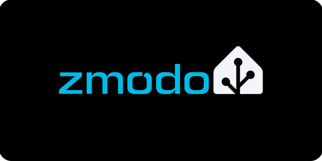

|  |
| :---: |

# Zmodo Home Assistant Integration

[![HACS Custom][hacs-shield]][hacs-url]
[![GitHub Release][release-shield]][release-url]
[![License][license-shield]](LICENSE)

A Home Assistant custom integration for **Zmodo / MeShare** cloud cameras.

> **Note:** This integration uses Zmodo's cloud API (the same one the iOS/Android app uses). Your cameras must be connected to the Zmodo/MeShare cloud — local-only setups are not supported.

---

## ⚡ Features

- 📷 **Camera entities** — SD and HD stream for each device
- 🎦 **Camera frame rate** — choose from low to high frame rate to control video quality
- 🔔 **Motion alert sensors** — last alert timestamp and 24-hour alert count per camera
- 🔊 **Volume slider** — increase and decrease device volume levels
- 🎙️ **Microphone switch** — turn your device's microphone on or off
- 🌙👁️ **Nightvision** — configure on/off/auto with sensitivity settings low/normal/high
- 🔃 **Automatic token refresh** — silently re-authenticates every 20 minutes using the same mechanism as the mobile app (no captcha, no re-entering credentials)
- 🔌 **Config flow** — set up from the HA UI with just your email and password

---

## 📖 Installation

### 🔄 Via HACS (recommended)

1. In Home Assistant, go to **HACS → Integrations**.
2. Click the three-dot menu (⋮) and choose **Custom repositories**.
3. Add `https://github.com/iamdoubz/ha-zmodo` as an **Integration**.
4. Find **Zmodo** in the HACS store and click **Download**.
5. Restart Home Assistant.

### ⬇️ Manual

1. Download the [latest release](https://github.com/iamdoubz/ha-zmodo/releases/latest).
2. Copy the `custom_components/zmodo` folder into your HA `config/custom_components/` directory.
3. Restart Home Assistant.

---

## ⚙️ Setup

1. Go to **Settings → Devices & Services → Add Integration**.
2. Search for **Zmodo**.
3. Enter your **Zmodo / MeShare email** and **password**.
4. Devices are discovered automatically.

---

## 💡 Entities

For each camera discovered on your account, the following entities are created:

| Entity | Type | Description |
|---|---|---|
| `camera.<name>_sd` | Camera | Standard definition (480p) live stream |
| `camera.<name>_hd` | Camera | High definition (1080p) live stream |
| `sensor.<name>_last_alert` | Timestamp | Time of the most recent motion event |
| `sensor.<name>_alert_count_24h` | Number | Motion alert count in the last 24 hours |
| `image.<name>_last_alert_image` | Image | Last motion clip image thumbnail |
| `image.<name>_device_image` | Image | Physical device image |
| `camera.<name>_last_alert_clip` | Camera | Last motion clip video (480p) |
| `sensor.<name>_last_alert_image_url` | String | Last motion clip image URL |
| `sensor.<name>_last_alert_video_url` | String | Last motion clip video URL |
| `switch.<name>_notifications` | Switch | Toggle notifications |
| `switch.<name>_microphone` | Switch | Toggle device microphone |
| `number.<name>_volume` | Number | Device volume slider |
| `select.<name>_frame_rate` | Select | Select device video frame rate |
| `select.<name>_night_vision_mode` | Select | Select device nightvision mode |
| `select.<name>_night_vision_sensitivity` | Select | Select device nightvision sensitivity |

---

## 🤷 Known limitations

- **Cloud-only**: All data passes through Zmodo/MeShare servers. No local network access to cameras is used.
- **PTZ**: Pan/tilt commands travel over a certificate-pinned binary protocol on Zmodo's VDR servers and cannot be controlled via this integration.
- **Token refresh**: The session token expires every ~24 minutes. The integration refreshes it proactively every 20 minutes using the `login_cert` obtained at login — identical to the mobile app behaviour.

---

## ⁉️ Troubleshooting

| Symptom | Likely cause | Fix |
|---|---|---|
| `invalid_auth` at setup | Wrong email/password | Re-enter credentials |
| Camera shows unavailable | `device_online = 0` in the Zmodo cloud | Camera is offline |
| Stream won't load | Token expired mid-stream | Wait for the 20-min refresh cycle, or reload HA |

---

## 🥼 Contributing

Pull requests welcome! Please open an issue first to discuss major changes.

---

[hacs-shield]: https://img.shields.io/badge/HACS-Custom-orange.svg?style=for-the-badge
[hacs-url]: https://github.com/hacs/integration
[release-shield]: https://img.shields.io/github/release/iamdoubz/ha-zmodo.svg?style=for-the-badge
[release-url]: https://github.com/iamdoubz/ha-zmodo/releases
[license-shield]: https://img.shields.io/github/license/iamdoubz/ha-zmodo.svg?style=for-the-badge
